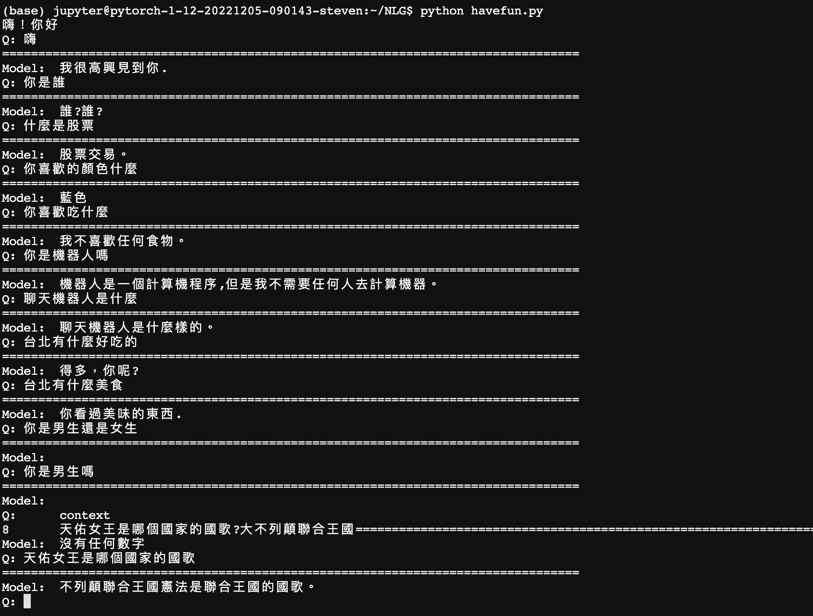

# GPT2 - OBeiGong

## Introduction
  The name "OBeiGong" is the pronunciation of Taiwanese, which means the answers is nonsense.LOL 

  Using the [chatbot dataset](https://github.com/gunthercox/chatterbot-corpus/tree/master/chatterbot_corpus/data/chinese) to make a simple QA model by fine-tuning the GPT2 model.

## Data Preprocessing
  In order to deal with large text input (length of tokens > 1024), the following strategy is using:  
  
  * split the text into two or more segments, called 'subtext', the subtext will  find the second to last punctuation in previous subtext and take the index of this punctuation and plus one as the begin of this subtext.  
  e.g. 今天天氣不好，感覺會下雨，記得帶把傘 , max length = 13 ---->  
       subtext1 : 今天天氣不好，感覺會下雨，  
       subtext2 : 感覺會下雨，記得帶把傘

## Demonstration
  
